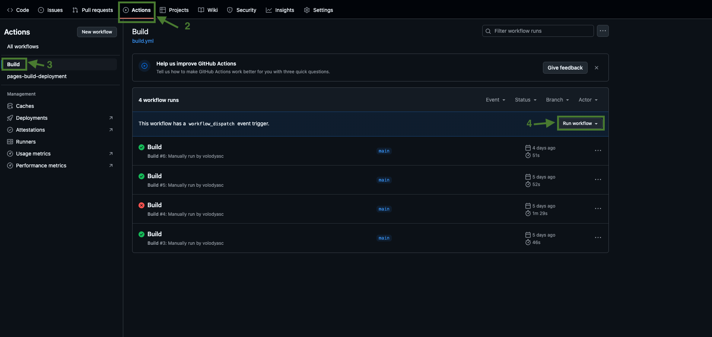
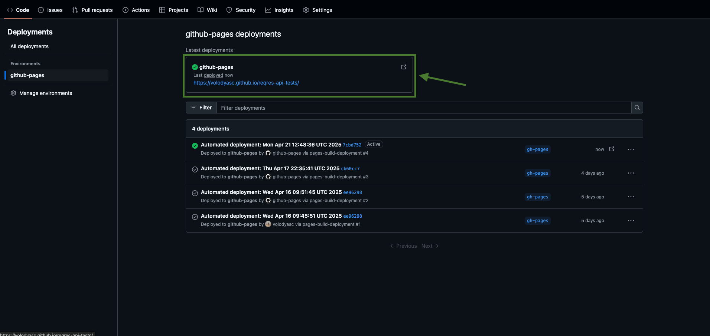
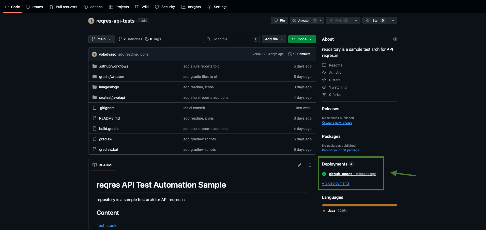
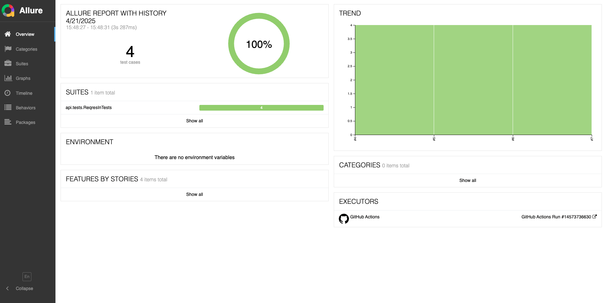
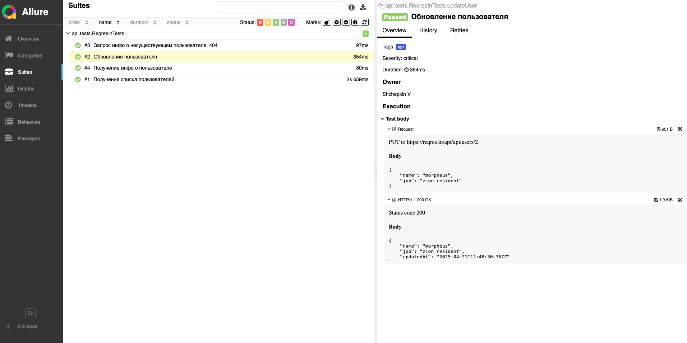

# reqres API Test Automation Sample

repository is a sample test arch for API reqres.in

## Content

[Tech stack](#tech-stack)  
[Run Tests Locally via Gradle](#-run-tests-locally-via-gradle)  
[Run Tests Remotely in GitHub Actions](#-run-tests-remotely-in-github-actions)  
[Allure report](#allure-report)

## Tech stack

Technologies and tools used in the project.

<p align="center">


</p>

> Automated tests are written in `Java` using the `Rest Assured` framework.
>
> `GitHub Actions` orchestrates the execution and delivery of tests.
>
> `Allure` provides test reports.
>
> `Gradle` is used to automate the project build process.
>
> `JUnit` is used as a testing framework.

##  Run Tests Locally via Gradle

Instructions on how to execute tests in the local environment.

To execute test run, run the following command in the terminal:
```
./gradlew clean api allureReport allureServe
```

##  Run Tests Remotely in GitHub Actions

How to run tests remotely using GitHub Actions.

1. Open repository in your browser.

2. Open Actions TAB.

3. Select Workflow

4. Select Run workflow on Build Actions.



> [!TIP]
> You may configure build triggers in `build.yml`.

run build manually
```
workflow_dispatch
```

run build on PR and push to main branch
```
  pull_request:
    branches:
      "main"
  push:
    branches:
      "main"
```

##  Allure report

### Generate and Open Allure Report via local host

Allure reports are generated and opened using the following command:
```
allureReport allureServe
```

### Open Allure report via GitHub Actions

Once the build is complete, open `Latest deployments` on github-pages deployments.




### Allure report screenshot


